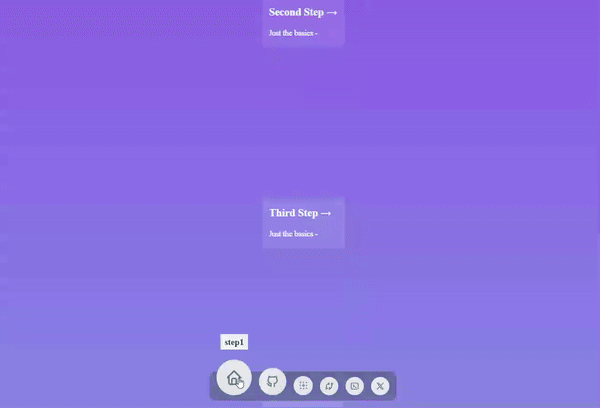

# NavbarT5

## Project Overview

**NavbarT5** is a React-based floating navbar menu that features smooth hover animations, built using **Framer Motion** and **TailwindCSS** . The project is powered by the T3 app template and utilizes the Next.js framework for efficient and fast development. This project is a great foundation for creating dynamic, animated, and highly interactive navigation menus in web applications.

## Features

- **Framer Motion** : Adds powerful animation capabilities, allowing the navbar to have hover animations with smooth transitions.
- **TailwindCSS** : Simplifies styling, making it easy to create responsive, modern, and clean designs.
- **Floating Navbar** : A responsive, floating navbar with hover effects for an interactive UI.
- **T3 App Template** : Built using the T3 app template, which integrates Next.js for fast server-side rendering and optimized performance.

## Installation

To get started with NavbarT5, follow these steps:

1. Clone the repository:

   <pre class="!overflow-visible">

bash

<button class="flex gap-1 items-center py-1"><svg width="24" height="24" viewBox="0 0 24 24" fill="none" xmlns="http://www.w3.org/2000/svg" class="icon-sm"><path fill-rule="evenodd" clip-rule="evenodd" d="M7 5C7 3.34315 8.34315 2 10 2H19C20.6569 2 22 3.34315 22 5V14C22 15.6569 20.6569 17 19 17H17V19C17 20.6569 15.6569 22 14 22H5C3.34315 22 2 20.6569 2 19V10C2 8.34315 3.34315 7 5 7H7V5ZM9 7H14C15.6569 7 17 8.34315 17 10V15H19C19.5523 15 20 14.5523 20 14V5C20 4.44772 19.5523 4 19 4H10C9.44772 4 9 4.44772 9 5V7ZM5 9C4.44772 9 4 9.44772 4 10V19C4 19.5523 4.44772 20 5 20H14C14.5523 20 15 19.5523 15 19V10C15 9.44772 14.5523 9 14 9H5Z" fill="currentColor"></path></svg>Copy code</button>

<code class="!whitespace-pre hljs language-bash">git clone https://github.com/ArsacidTechnologies/navbar-t5.git
   cd navbar-t5
   </code>

</pre>
2. Install the dependencies:

   <pre class="!overflow-visible">

bash

<button class="flex gap-1 items-center py-1"><svg width="24" height="24" viewBox="0 0 24 24" fill="none" xmlns="http://www.w3.org/2000/svg" class="icon-sm"><path fill-rule="evenodd" clip-rule="evenodd" d="M7 5C7 3.34315 8.34315 2 10 2H19C20.6569 2 22 3.34315 22 5V14C22 15.6569 20.6569 17 19 17H17V19C17 20.6569 15.6569 22 14 22H5C3.34315 22 2 20.6569 2 19V10C2 8.34315 3.34315 7 5 7H7V5ZM9 7H14C15.6569 7 17 8.34315 17 10V15H19C19.5523 15 20 14.5523 20 14V5C20 4.44772 19.5523 4 19 4H10C9.44772 4 9 4.44772 9 5V7ZM5 9C4.44772 9 4 9.44772 4 10V19C4 19.5523 4.44772 20 5 20H14C14.5523 20 15 19.5523 15 19V10C15 9.44772 14.5523 9 14 9H5Z" fill="currentColor"></path></svg>Copy code</button>

<code class="!whitespace-pre hljs language-bash">yarn install
   </code>

</pre>
3. 
4. Start the development server:

   <pre class="!overflow-visible">

bash

<button class="flex gap-1 items-center py-1"><svg width="24" height="24" viewBox="0 0 24 24" fill="none" xmlns="http://www.w3.org/2000/svg" class="icon-sm"><path fill-rule="evenodd" clip-rule="evenodd" d="M7 5C7 3.34315 8.34315 2 10 2H19C20.6569 2 22 3.34315 22 5V14C22 15.6569 20.6569 17 19 17H17V19C17 20.6569 15.6569 22 14 22H5C3.34315 22 2 20.6569 2 19V10C2 8.34315 3.34315 7 5 7H7V5ZM9 7H14C15.6569 7 17 8.34315 17 10V15H19C19.5523 15 20 14.5523 20 14V5C20 4.44772 19.5523 4 19 4H10C9.44772 4 9 4.44772 9 5V7ZM5 9C4.44772 9 4 9.44772 4 10V19C4 19.5523 4.44772 20 5 20H14C14.5523 20 15 19.5523 15 19V10C15 9.44772 14.5523 9 14 9H5Z" fill="currentColor"></path></svg>Copy code</button>

<code class="!whitespace-pre hljs language-bash">yarn dev
   </code>

</pre>

## Available Scripts

- **`yarn dev`** : Starts the Next.js development server.
- **`yarn build`** : Builds the project for production.
- **`yarn start`** : Starts the production server.
- **`yarn lint`** : Runs ESLint to check for code quality issues.

## Dependencies

- **Framer Motion** : For animations.
- **TailwindCSS** : For utility-first CSS styling.
- **Next.js** : As the core framework.
- **Typescript** : For type safety and cleaner code.
- **Geist** : Provides UI components.
- **Zod** : For schema validation.

## Dev Dependencies

- **ESLint** : For linting.
- **Prettier** : For code formatting.
- **TailwindCSS Plugins** : For additional Tailwind functionality.
- **TypeScript** : TypeScript configuration and type definitions.

## How the Navbar Works

The floating navbar is designed with **TailwindCSS** for styling and layout. **Framer Motion** is used to apply hover animations, giving users a smooth and dynamic experience when interacting with the menu items.

To adjust the behavior or add more animations, you can modify the `framer-motion` properties in the components and tweak the `TailwindCSS` classes for different styles.

## License

This project is licensed under the MIT License.

---

Feel free to explore and modify the project to suit your needs!
